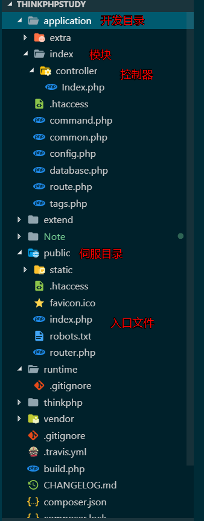

# 基础知识

## 参考资料
[ThinkPHP5.0完全开发手册](https://www.kancloud.cn/manual/thinkphp5/118003)


## 项目基本目录结构




## 开启调试模式

默认后台出现错误，php并不会报错，防止前台获取后台泄露的信息。

如需在后台异常的情况下暴露错误信息，需要修改配置文件。

`application\config.php`下，修改

```php
// 应用调试模式
// 'app_debug'              => false,
   'app_debug'              => true,	
```


## URL规则

### 访问格式
```
http:\\localhost\public\index.php\模块\控制器\函数
```

1. 可以设置public目录为网站根目录，简化访问地址，则简化后的目录
```
http:\\localhost\index.php\模块\控制器\函数
```

2. 可以修改public/index.php同级的.htaccess文件隐藏入口文件
```
<IfModule mod_rewrite.c>
  Options +FollowSymlinks -Multiviews
  RewriteEngine On

  RewriteCond %{REQUEST_FILENAME} !-d
  RewriteCond %{REQUEST_FILENAME} !-f
  <!--RewriteRule ^(.*)$ index.php/$1 [QSA,PT,L]-->
  <!--在index.php后面添加一个？-->
  RewriteRule ^(.*)$ index.php?/$1 [QSA,PT,L]
</IfModule>
```

### 参数传递


`application\index\controller\index.php`
```php
<?php
namespace app\index\controller;

class Index
{
    public function index($name='')
    {
        return 'hello, '.$name ;
    }
}

```

则传递参数的格式为   
`http://localhost/模块/控制器/方法/[形参名]/[形参值]`

具体的事例  
`http://www.tpstudy.com/index/index/index/name/%E6%9D%8E`


## 开发规范

* 类和类文件统一采用驼峰命名法，并保持一致例如 `User`,不要添加后缀例如`UserController`  ，其他文件采用小写+下滑线命名。

* 属性和方法使用首字母小写的驼峰命名法，例如`tableName`,`getUserName`

* 目录统一使用小写+下划线

* 函数的命名使用小写字母和下划线（小写字母开头）的方式，例如 `get_client_ip`;

* 数据表和字段采用小写加下划线方式命名，并注意字段名不要以下划线开头，例如 think_user 表和 user_name字段，不建议使用驼峰和中文作为数据表字段命名。

